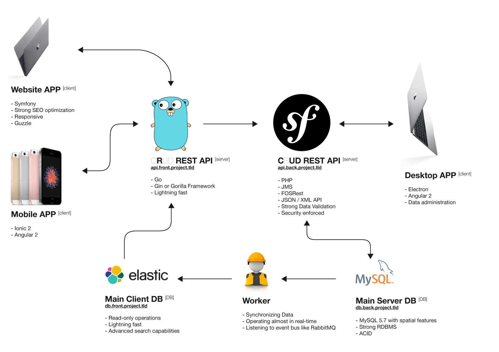
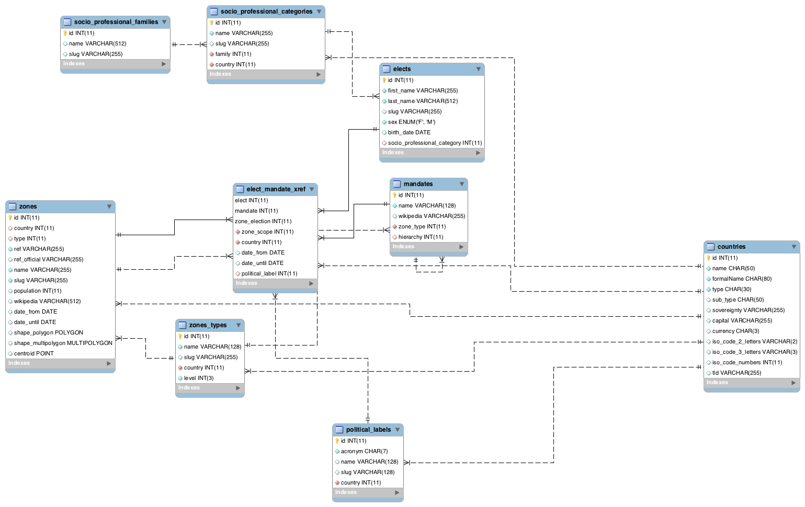

{politics project}
==================

## Emergency

Find a name for the project !   

* demo / people  
* [Democraty history](https://en.wikipedia.org/wiki/Democracy)  
* [Vaisali](https://en.wikipedia.org/wiki/Vaisali), first democraty ever  
* [Anarchist culture](https://en.wikipedia.org/wiki/Temporary_Autonomous_Zone)  

Find a graphical identity

* may be variable according to user profile and its political opinions  
* must be very apolitical

## Technical Architecture Specs

### Git Management

*"One repo rules'em all."*

Everything in one monolythic repository, every components splitted with [split.sh](https://github.com/splitsh/lite)

### Frontend API - Golang

This fast and simple API will query Elastic Search to answer to all resources reading needs, and on some situations call the backend API to create, update and delete resources.

### Backend API - PHP

This strong and complex API will interact with a MySQL 5.7 database and will obviously expose its own resources to the administration tool.

### Priorities

1. Backend API
2. Desktop APP
3. Frontend API
4. Mobile APP
5. Website APP

## Backend RDBMS schema

#### Technical choice

MySQL 5.7 is currently used, PostGreSQL with PostGIS extension could be a reasonable candidate too.

### Updates to be done

* add rating tables
* user table ? if not in another service

##@TODO Data

* Consolidate french data 
	* geographical data 
		* old and new versions of "cantons" and "regions"
		* Find a way to simplify some heavy administrative areas (store a simplified version for display and a full version for spatial operations in DB ?)
	* mandates
		* should reflect a new boolean attribute : obtained from an election or not (i.e. french ministers are nominated by the president)
	* elects to mandates association
		* should reflect if elect is in majority

## Backend API Routing

### General considerations

* API must be fully stateless
* API must be [semantically versioned](semver.org)
* API may expose data through schema.org JSON schemas and may implements JSON-LD specifications 

### Zones Types 

|Methods          | Routes                                                |
|-----------------|-------------------------------------------------------|
|**GET**          | /{locale}/zones-types                                 |
|**GET**          | /{locale}/zones-types/{type}                          |
|**PUT**          | /{locale}/zones-types/{type}                          |
|**DELETE**       | /{locale}/zones-types/{type}                          |
|**POST**         | /{locale}/zones-types/                                |

### Zones

|Methods          | Routes                                                |
|-----------------|-------------------------------------------------------|
|**GET**          | /{locale}/zones                                       |
|**GET**          | /{locale}/zones-types/{type}/zones                    |
|**GET**          | /{locale}/zones/{slug}                                |
|**GET**          | /{locale}/zones-types/{type}/zones/{slug}             |
|**PUT**          | /{locale}/zones/{slug}                                |
|**PUT**          | /{locale}/zones-types/{type}/zones/{slug}             |
|**DELETE**       | /{locale}/zones/{slug}                                |
|**DELETE**       | /{locale}/zones-types/{type}/zones/{slug}             |
|**POST**         | /{locale}/zones-types/{type}/zones                    |

### Mandates

|Methods          | Routes                                                |
|-----------------|-------------------------------------------------------|
|**GET**          | /{locale}/mandates/{slug}                             |
|**GET**          | /{locale}/zones-types/{type}/mandates/{slug}          |
|**PUT**          | /{locale}/mandates/{slug}                             |
|**PUT**          | /{locale}/zones-types/{type}/mandates/{slug}          |
|**DELETE**       | /{locale}/mandates/{slug}                             |
|**DELETE**       | /{locale}/zones-types/{type}/mandates/{slug}          |
|**POST**         | /{locale}/mandates/                                   |

### Elects

|Methods          | Routes                                                |
|-----------------|-------------------------------------------------------|
|**GET**          | /{locale}/elects                                      |
|**GET**          | /{locale}/zones-types/{type}/zones/{id}/elects        |
|**GET**          | /{locale}/elects/{id}                                 |
|**GET**          | /{locale}/zones-types/{type}/zones/{id}/elects/{id}   |
|**PUT**          | /{locale}/elects/{id}                                 |
|**PUT**          | /{locale}/zones-types/{type}/zones/{id}/elects/{id}   |
|**DELETE**       | /{locale}/elects/{id}                                 |
|**DELETE**       | /{locale}/zones-types/{type}/zones/{id}/elects/{id}   |
|**POST**         | /{locale}/elects                                      |
|**POST**         | /{locale}/zones-types/{type}/zones/{id}/elects        |

## Nice-to-have

* Data aggregation from daily newspapers
* Data aggregation from wikipedia
* Social networks account of elects 

